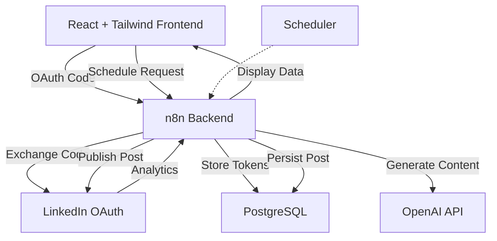

# SAAS Platform Architecture

This document outlines the architecture for a SaaS tool that allows users to schedule AI-generated LinkedIn posts in their preferred tone and niche. The stack includes a React frontend styled with Tailwind CSS, n8n workflows for backend logic, OpenAI for AI content generation, LinkedIn APIs for posting and analytics, and PostgreSQL for persistence.

## Component Responsibilities

- **React + Tailwind Frontend**
  - Handles user authentication via LinkedIn OAuth.
  - Provides a UI to configure AI settings (tone, niche, schedule).
  - Displays scheduled posts and analytics fetched from the backend.

- **n8n Workflows Backend**
  - Manages API routes for the frontend (auth callbacks, scheduling, analytics).
  - Integrates with LinkedIn API to obtain and refresh access tokens, schedule posts, and fetch engagement metrics.
  - Calls OpenAI to generate post content based on user configuration.
  - Stores user records, LinkedIn tokens, and scheduled posts in PostgreSQL.

- **OpenAI**
  - Generates post text in the user's desired tone and topic.

- **PostgreSQL**
  - Persists user data, OAuth tokens, and scheduled post metadata.

## Data Flow

1. **User Login**
   - The user accesses the React app and initiates LinkedIn OAuth.
   - LinkedIn redirects back with an authorization code, which the frontend sends to n8n.
   - n8n exchanges the code for access and refresh tokens, storing them in PostgreSQL.

2. **Scheduling a Post**
   - The user specifies the desired tone, niche, and schedule in the React UI.
   - The frontend sends this schedule request to n8n.
   - n8n triggers an OpenAI workflow to generate post content.
   - The resulting post is stored with its schedule in PostgreSQL.

3. **Post Execution**
   - At the scheduled time, n8n retrieves the stored post and uses the LinkedIn API to publish it.
   - After posting, n8n collects engagement metrics and updates the database for analytics displayed in the frontend.

## System Diagram



## Suggested Monorepo Structure

```text
saas/
├── apps/
│   ├── web/             # React + Tailwind frontend
│   └── workflows/       # n8n workflows and custom nodes
├── packages/
│   └── shared/          # Common utilities and types
├── db/
│   ├── migrations/      # SQL migrations
│   └── seed/            # Seed scripts
├── scripts/             # Deployment and CI scripts
└── README.md            # Project overview
```

